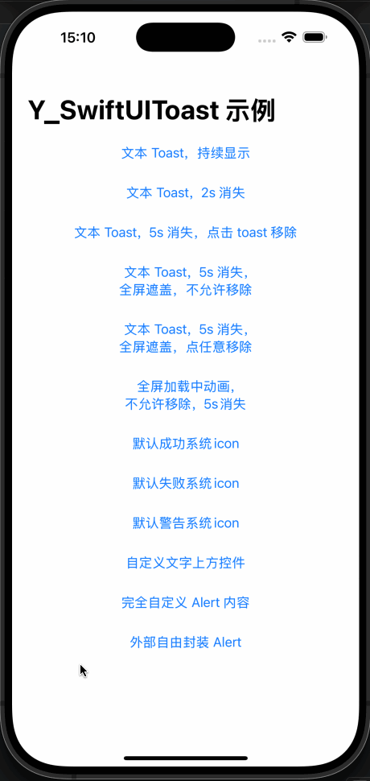

# Y_SwiftUIToast 
iOS14+ 在 SwiftUI 中使用的 toast，调用简单，支持自定义 icon 和组件，便于使用

## 功能说明

- 1. **在入口页或根页增加全局 toast 入口**
- 2. 使用 `Y_Toast.show()` 展示 toast


```swift
struct ExampleApp: App {
    var body: some Scene {
        WindowGroup {
            ContentView()
                // 可在根页增加全局 toast 入口
                .y_addToastOverlay()
        }
    }
}
```

### 简单文本/图标 Toast
```swift
/// 显示Toast提示
/// - Parameters:
///   - text: 显示的文本内容（必需）
///   - image: 文字上方的图片/控件（可选）
///   - isFullScreen: 是否显示全屏透明遮盖层，默认false
///   - canTapRemove: 是否允许点击移除Toast，默认false
///   - disableTransition: 取消转场动画，默认 false，不取消
///   - duration: 自动消失时间（秒），默认0.0表示不自动消失
public static func show(
    text: String,
    image: Y_ToastImageType? = nil,
    isFullScreen: Bool = false,
    canTapRemove: Bool = false,
    disableTransition: Bool = false,
    duration: TimeInterval = 0.0
)


// MARK: - 调用

// 简单文本 toast，一直显示
Y_Toast.show(text: string)
// 2秒后自动消失 toast
Y_Toast.show(text: string, duration: 2)
// 全屏遮盖 toast，其后面的内容无法被响应
Y_Toast.show(text: string, isFullScreen: true)
// 手动点击移除 toast
Y_Toast.show(text: string, canTapRemove: true)
// 上图下字 toast，（包内图标）即 Imgae("imageName")
Y_Toast.show(text: string, image: .imageName("imageName"))
// 上图下字 toast，（系统icon图标）即 Image(systemName: "iconName")
Y_Toast.show(text: string, image: .systemIcon("iconName"))
// 上加载中下字 toast，（系统 UIActivityIndicatorView 样式）
Y_Toast.show(text: string, image: .activityIndicator)
```

### 自定义图标组件 Toast
```swift
/// 显示带自定义图像的 Toast 提示
/// - Parameters:
///   - text: 显示的文本内容（必需）
///   - customImage: 自定义文字上方视图构建器
///   - isFullScreen: 是否显示全屏透明遮盖层，默认 false
///   - canTapRemove: 是否允许点击移除Toast，默认 false
///   - disableTransition: 取消转场动画，默认 false，不取消
///   - duration: 自动消失时间（秒），默认 0.0 表示不自动消失
public static func show<CustomImage: View>(
    text: String,
    @ViewBuilder customImage: @escaping () -> CustomImage,
    isFullScreen: Bool = false,
    canTapRemove: Bool = false,
    disableTransition: Bool = false,
    duration: TimeInterval = 0.0
) 


// MARK: - 调用

// 自定义的一个橘色加载中，全屏遮盖，5秒消失，可点击移除的 toast
Y_Toast.show(
    text: string,
    customImage: {
        ProgressView()
            .progressViewStyle(
                CircularProgressViewStyle(tint: .orange)
            )
    },
    isFullScreen: true,
    canTapRemove: true,
    duration: 5.0
)
```

### 完全自定义组件的 Toast
```swift
/// 显示带完全自定义内容的 Toast
/// - Parameters:
///   - customContent: 完全自定义内容视图构建器
///   - isFullScreen: 是否显示全屏透明遮盖层，默认 false
///   - canTapRemove: 是否允许点击移除Toast，默认 false
///   - disableTransition: 取消转场动画，默认 false，不取消
///   - duration: 自动消失时间（秒），默认 0. 表示不自动消失
public static func show<CustomContent: View>(
    @ViewBuilder customContent: @escaping () -> CustomContent,
    isFullScreen: Bool = false,
    canTapRemove: Bool = false,
    disableTransition: Bool = false,
    duration: TimeInterval = 0.0
) 


// MARK: - 调用

// 完全自定义视图的 Toast，全屏遮盖，5秒消失，可点击移除
Y_Toast.show(
    customContent: {
       CustomView()
    },
    isFullScreen: true,
    canTapRemove: true,
    duration: 5,
)
```

### 通过便利简单方法展示 Toast

- **`Y_Toast.showText()`** - 显示简单的文本 Toast
- **`Y_Toast.showImage()`** - 显示带图标的 Toast
- **`Y_Toast.showAutoDismiss()`** - 显示全屏 Toast 提示, 2 秒后移除
- **`Y_Toast.showFullScreen()`** - 显示全屏遮盖的 Toast，点击移除
- **`Y_Toast.showTimed()`** - 显示几秒后自动消失的 Toast
- **`Y_Toast.showSuccess()`** - 显示成功提示的 Toast
- **`Y_Toast.showError()`** - 显示错误提示的 Toast
- **`Y_Toast.showWarning()`** - 显示警告提示的 Toast
- **`Y_Toast.showLoading()`** - 显示加载中的 Toast


### 其他方法

- **`Y_ToastManager.enableDebugLog()`** - 开启输出调试信息（仅 DEBUG）
- **`Y_Toast.dismiss()`** - 移除当前显示的 toast
- **`Y_Toast.isPresenting`** - 当前是否正在展示 toast
- **`Y_Toast.currentConfig`** - 当前展示 toast 的配置


## 详细使用参见 Example

